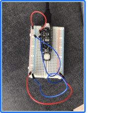

# IDD-Fa19-Lab1: Blink!

## Part A. Set Up a Breadboard

## Part B. Manually Blink a LED

**a. What color stripes are on a 100 Ohm resistor?**

5 bands - red, red, black, black, brown
 
**b. What do you have to do to light your LED?**
I have to manually press the button to light my LED

## Part C. Blink a LED using Arduino

### 1. Blink the on-board LED

**a. What line(s) of code do you need to change to make the LED blink (like, at all)?**

No code change

**b. What line(s) of code do you need to change to change the rate of blinking?**

I have to change the delay. e.g. 

`
delay(1000)
`
->
`
delay(2000)
`
will decrease the rate of blinking.

**c. What circuit element would you want to add to protect the board and external LED?**

A resistor.
 
**d. At what delay can you no longer *perceive* the LED blinking? How can you prove to yourself that it is, in fact, still blinking?**

Less than 10ms

**e. Modify the code to make your LED blink your way. Save your new blink code to your lab 1 repository, with a link on the README.md.**

[BlinkMyWay](../src/lab1/Blink.ino)

### 2. Blink your LED

**Make a video of your LED blinking, and add it to your lab submission.**

[Blink](https://www.youtube.com/watch?v=X3hwCt1hwiM)

## Part D. Manually fade an LED

**a. Are you able to get the LED to glow the whole turning range of the potentiometer? Why or why not?**

No. The max resistance of the potentiometer is 10K Ohm. Even at the maximum, there is still enough voltage that LED can get to glow.

## Part E. Fade an LED using Arduino

**a. What do you have to modify to make the code control the circuit you've built on your breadboard?**

I changed the PWM pin for LED from pin 9 to pin 11.

**b. What is analogWrite()? How is that different than digitalWrite()?**

The `analogWrite()` method sets the value of a PWM output pin (on a scale of 0-255), while `digitalWrite()` will set the specified pin to one of two states - HIGH/LOW

## Part F. FRANKENLIGHT!!!

### 1. Take apart your electronic device, and draw a schematic of what is inside. 

It is a mechanical keyboad. (Mechanical switches on PCB board)

**a. Is there computation in your device? Where is it? What do you think is happening inside the "computer?"**

Yes there is a 8-bit microcontroller on the pcb board.

**b. Are there sensors on your device? How do they work? How is the sensed information conveyed to other portions of the device?**

No there is no sensor.

**c. How is the device powered? Is there any transformation or regulation of the power? How is that done? What voltages are used throughout the system?**

It is powered via USB-mini cable, with a 5V voltage.

**d. Is information stored in your device? Where? How?**

Yes. The keyboard supports multiple layers of keymaps and there has to be a storage unit for this information. Unfortunately I was able to identify the exact storage device.

### 2. Using your schematic, figure out where a good point would be to hijack your device and implant an LED.

Since there is a steel board soldered on top of the pcb board, we had to look from the back. Fortunately we identified voltage differences on the back of every key (as in keyboard). We were planning to hook 3 of the keys with an RGB LED so that we can alternate the light by pressing different keys. It turned out to be somewhat impossible given the structure of our board. Instead we added a pressure-resistor so that different levels of pressure results in different color of the LED. We also integrate the key presses to blink the LED.

### 3. Build your light!

[Frankenlight](https://www.youtube.com/watch?v=PWWyPDEPc98)
