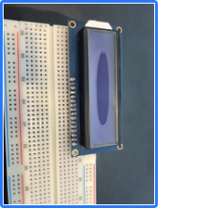

# Digital Timer

## Part A. Solder your LCD panel



## Part B. Writing to the LCD
 
**a. What voltage level do you need to power your display?**

5V

**b. What voltage level do you need to power the display backlight?**

3.3V
   
**c. What was one mistake you made when wiring up the display? How did you fix it?**

This was the first time I used a long breadboard, and I did not notice the two halves of the board were not connected by default. After manually connecting the two halves, my LCD was lit up.

**d. What line of code do you need to change to make it flash your name instead of "Hello World"?**

```lcd.print("hello, world!");```

->

```lcd.print("$MYNAME!");```
 
**e. Include a copy of your Lowly Multimeter code in your lab write-up.**

[Lowly Multimeter](../src/lab2/Voltmeter.ino)

## Part C. Using a time-based digital sensor

**Upload a video of your working rotary encoder here.**

[](https://www.youtube.com/watch?v=jJ74yyYGNtI)


## Part D. Make your Arduino sing!

**a. How would you change the code to make the song play twice as fast?**

I need to change the duration for each note.
```
int noteDurations[] = {
  4, 8, 8, 4, 4, 4, 4, 4
};
```
->
```
int noteDurations[] = {
  8, 16, 16, 8, 8, 8, 8, 8
};
```
 
**b. What song is playing?**

Star Wars


## Part E. Make your own timer

**a. Make a short video showing how your timer works, and what happens when time is up!**

[](https://www.youtube.com/watch?v=IUFlvdQyQvI&feature=youtu.be)

**b. Post a link to the completed lab report your class hub GitHub repo.**
