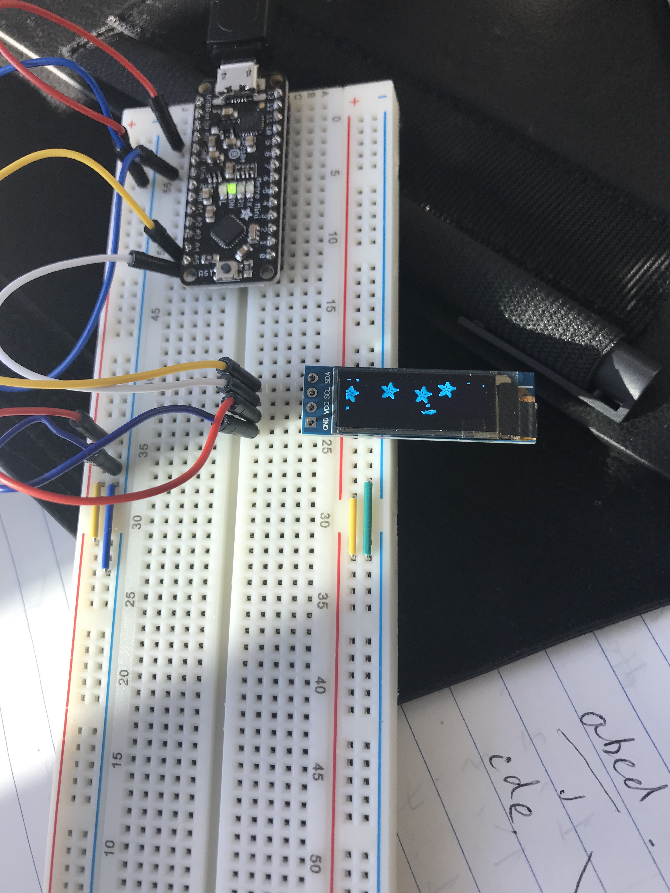
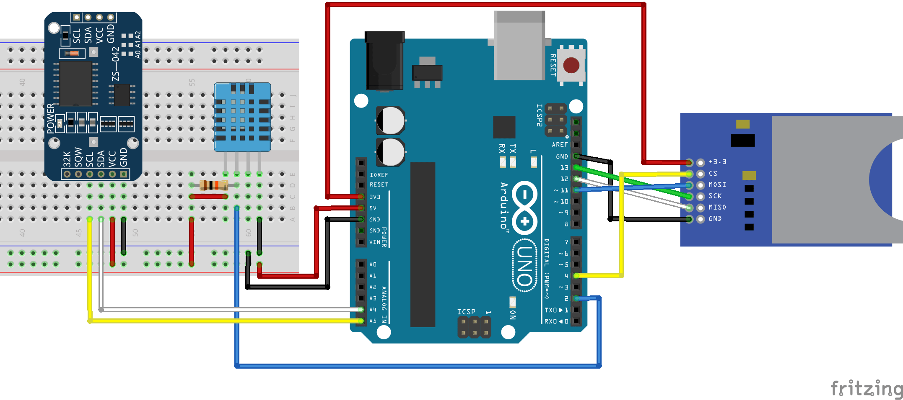

# Data Logger (and using cool sensors!)

*A lab report by Fei Gao*

## In The Report

For this lab, we will be experimenting with a variety of sensors, sending the data to the Arduino serial monitor, writing data to the EEPROM of the Arduino, and then playing the data back.

## Part A.  Writing to the Serial Monitor
 
**a. Based on the readings from the serial monitor, what is the range of the analog values being read?**

0-1023
 
**b. How many bits of resolution does the analog to digital converter (ADC) on the Arduino have?**

10 bits

## Part B. RGB LED

**How might you use this with only the parts in your kit? Show us your solution.**

I can hook the three legs of RGB LED with three potentiometer, respectively. Then I am able to adjust the color of the LED gradually by turning the resistance up or down.

## Part C. Voltage Varying Sensors 
 
### 1. FSR, Flex Sensor, Photo cell, Softpot

**a. What voltage values do you see from your force sensor?**

Between 100-1000

**b. What kind of relationship does the voltage have as a function of the force applied? (e.g., linear?)**

Linear

**c. Can you change the LED fading code values so that you get the full range of output voltages from the LED when using your FSR?**

Yes. `map(output, 0, 1023, 0, 255);`

**d. What resistance do you need to have in series to get a reasonable range of voltages from each sensor?**

10K Ohm

**e. What kind of relationship does the resistance have as a function of stimulus? (e.g., linear?)**

Flex: logarithmic
Photo: Linear

### 2. Accelerometer
 
**a. Include your accelerometer read-out code in your write-up.**

[Code](../src/lab3/LCD.ino)

### 3. IR Proximity Sensor

**a. Describe the voltage change over the sensing range of the sensor. A sketch of voltage vs. distance would work also. Does it match up with what you expect from the datasheet?**

**b. Upload your merged code to your lab report repository and link to it here.**

## Graphic Display

**Take a picture of your screen working insert it here!**



## Part D. Logging values to the EEPROM and reading them back
 
### 1. Reading and writing values to the Arduino EEPROM

**a. Does it matter what actions are assigned to which state? Why?**

It does. The "clear" action should not be state 1. Otherwise, memory will be cleared on our way to read/write to memory.

**b. Why is the code here all in the setup() functions and not in the loop() functions?**

Because we only want to perform one operation (R/W/C) at each state switch. Otherwise, it will be a waste of I/O operations.

**c. How many byte-sized data samples can you store on the Atmega328?**

1024

**d. How would you get analog data from the Arduino analog pins to be byte-sized? How about analog data from the I2C devices?**

Need to divide by 4 because analog inputs range from 0 to 1023 and each byte of the EEPROM can only hold a value from 0 to 255.

The analog data from I2C devices are 8 bytes in size, so we will need to divide by 8.

**e. Alternately, how would we store the data if it were bigger than a byte? (hint: take a look at the [EEPROMPut](https://www.arduino.cc/en/Reference/EEPROMPut) example)**

```
eeAddress += sizeof(float);

EEPROM.put(eeAddress, customVar);
```

We pass the address to the next byte after the data we want to store

**Upload your modified code that takes in analog values from your sensors and prints them back out to the Arduino Serial Monitor.**

[eeprom](../src/lab3/eeprom.ino)


### 2. Design your logger
 
**a. Insert here a copy of your final state diagram.**

The following content refers to this online tutorial (https://randomnerdtutorials.com/arduino-temperature-data-logger-with-sd-card-module/)



### 3. Create your data logger!
 
**a. Record and upload a short demo video of your logger in action.**
